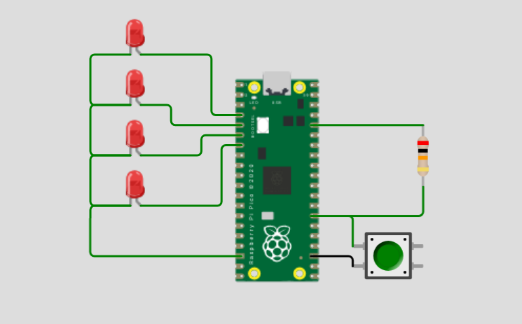

# binary-die
C++ implementation of a binary die. As long as button is pressed, a counter rotates between 1 and 15. Releasing the button 
stops the counter and displays the binary representation of the value on 4 LEDs.

This directory contains all files for running the project in the wokwi simulator under Visual Studio Code.

